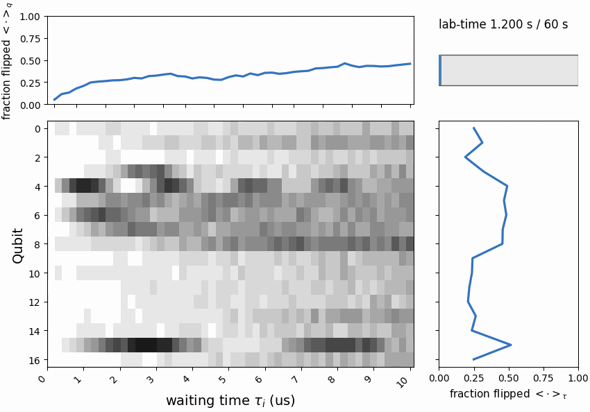
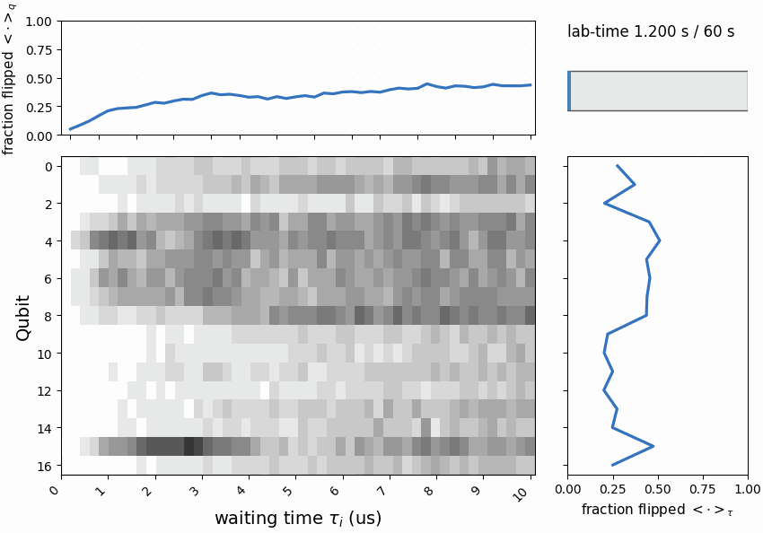

# Quantum Gym

Quantum + ML workflow for creating an efficient low-dimensional representation of a noisy quantum system. This digital twin approach can be used for control, monitoring, and diagnostics of the system. 

## What this repo does

- Trains a VAE model on qubit/tau readout data.
- Analyzes latent dynamics across shots and qubits.
- Generates synthetic zebra outputs from sampled or simulated latents.
- Produces visual outputs (GIFs/plots) for quick inspection.

## Demo GIFs

Add generated GIFs to `docs/gifs/` with the names below so they render in this README:

### Running average of qubit response


### Latent dynamics animation (comparison across two days)


### Generated artificial data


## How to run

Run from repo root:

```bash
cd /Users/krzywdaja/Documents/quantum-gym
```

Train model:

```bash
python ML/training/train_vae_model.py
```

Analyze latent dynamics:

```bash
python ML/analysis_processing/generate_latent_dynamics.py
```

Generate synthetic zebra:

```bash
python ML/analysis_processing/generate_synthetic_zebra.py --latent-mode iid
```

Simulate fitted latent zebra:

```bash
python ML/analysis_processing/simulate_latent_zebra.py --sim-mode ou
```
