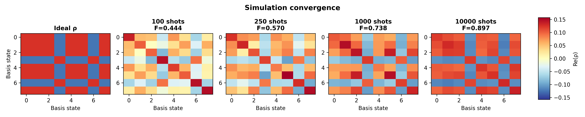
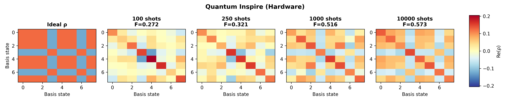
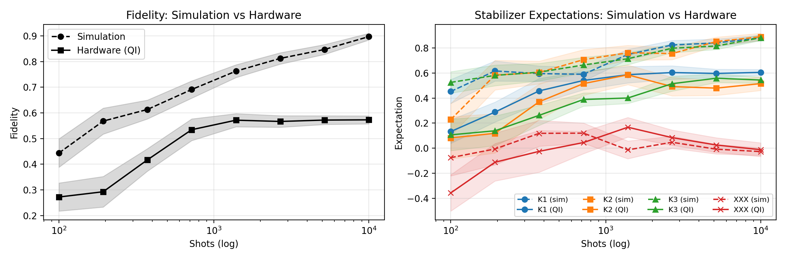

# shadow_gym

**Hardware-softmax shadow tomography** on Quantum Inspire (Tuna-17).

Classical shadow tomography normally requires a fresh randomly-sampled circuit for every shot, creating a crippling classical-quantum round-trip on cloud platforms.  
This gym bypasses the bottleneck by **embedding the random basis choice directly into the quantum circuit** using ancilla mid-circuit measurements — no inter-shot communication with the classical host required.

## The protocol

Each data qubit is paired with two dedicated ancilla qubits.  
The ancillas are initialised with biased $R_y$ rotations, measured mid-circuit, and their outcomes control $CR_y / CR_x$ rotations on the data qubit, physically setting the measurement basis for that shot.

| Ancilla outcome $(a_1, a_2)$ | Measurement basis |
|---|---|
| `(0, 0)` | $Z$ |
| `(1, 0)` | $X$ |
| `(0, 1)` | $Y$ |
| `(1, 1)` | $Y$ (diagonal) |

The desired basis distribution $P(X), P(Y), P(Z)$ maps to ancilla rotation angles via:

```python
def softmax_to_angles(px, py, pz):
    p2 = py
    p1 = px / (px + pz + 1e-12)
    theta1 = 2.0 * np.arcsin(np.sqrt(np.clip(p1, 0, 1)))
    theta2 = 2.0 * np.arcsin(np.sqrt(np.clip(p2, 0, 1)))
    return theta1, theta2
```

## Hardware setup — Tuna-17

3 data qubits on a 1D chain, each with 2 dedicated ancillas:

| Data qubit | Ancilla $A_1$ | Ancilla $A_2$ |
|---|---|---|
| Q5 | Q2 | Q9 |
| Q8 | Q4 | Q12 |
| Q11 | Q7 | Q14 |

## Results

### Density matrix reconstruction

The plots below are generated by running `notebooks/shadow_tomography_full.ipynb`.

**Simulation** — ideal 3-qubit cluster state reconstructed from statevector samples:



**Hardware (Tuna-17)** — same reconstruction from real device shots:



The reconstructed density matrix qualitatively matches the ideal state at all shot counts. Reduced off-diagonal amplitudes in the hardware case are consistent with gate and QND-readout imperfections on the device.

### Fidelity & stabilizer expectations — simulation vs hardware



The 3-qubit cluster state has three stabilisers $K_1 = XZI$, $K_2 = ZXZ$, $K_3 = IZX$ with ideal expectation value $+1$.  
The observable $XXX$ (expected value $0$) serves as a null check.

### Stabilizer fidelity convergence


> **Note:** all plot files are produced the first time `shadow_tomography_full.ipynb` is executed end-to-end.

## Structure

```
shadow_gym/
├── src/
│   ├── quantum_environment.py   # Cluster state prep, statevector sampling
│   ├── shadow_processor.py      # Classical shadow reconstruction
│   └── utils.py                 # Pauli helpers, kron utilities
└── notebooks/
    ├── shadow_tomography_full.ipynb   # Merged sim + hardware pipeline
    └── data/                          # Saved metrics (.npz) and pickled shots
```

## Quick start

```bash
# From repo root — open the merged notebook
jupyter lab shadow_gym/notebooks/shadow_tomography_full.ipynb
```

The notebook runs in order:
1. Connect to Quantum Inspire and define qubit layout
2. Simulate 10 000 feedback-shadow shots on the ideal cluster state
3. Reconstruct $\rho$ at multiple shot counts (simulation)
4. Bootstrap convergence metrics → saved to `notebooks/data/mock_convergence_metrics.npz`
5. Build the hardware shadow circuit, submit to Tuna-17, pickle results
6. Decode hardware bitstrings and reconstruct $\rho$
7. Side-by-side fidelity + stabilizer plot (sim vs hardware)
8. EFE active inference: compute next optimal basis distribution
9. Stabilizer fidelity convergence curve
